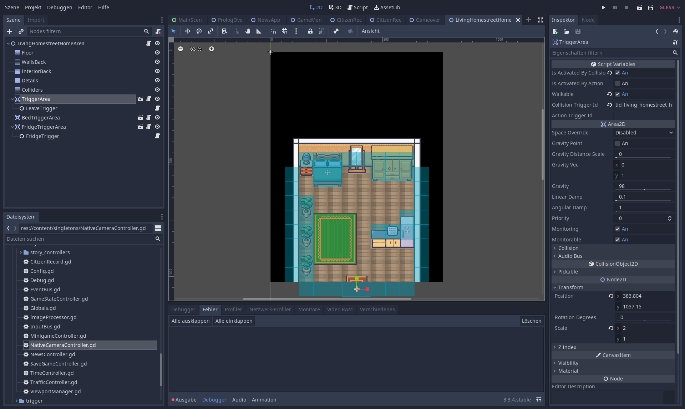
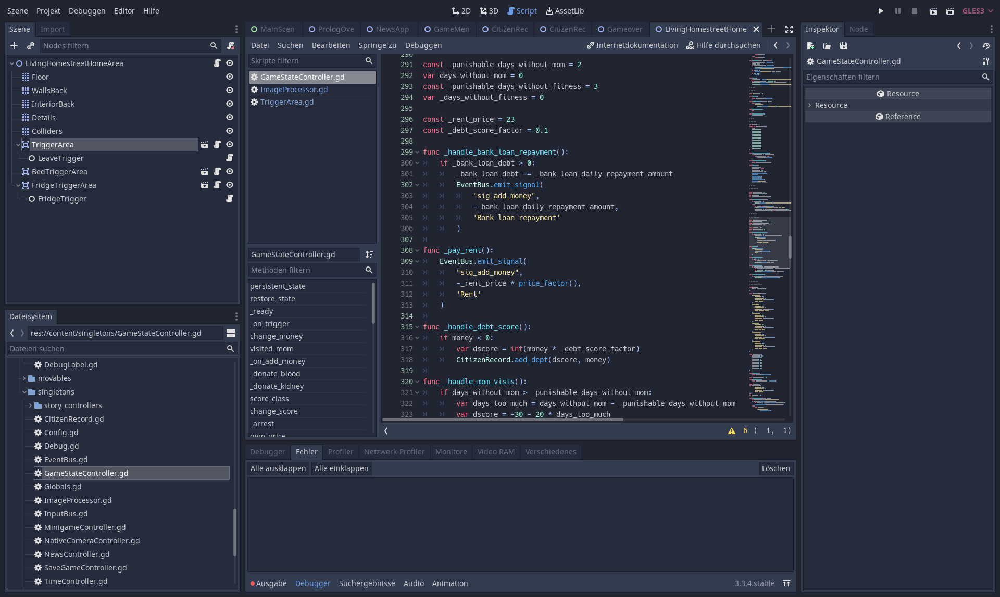

# Social Highscore

## Inhaltsverzeichnis
1. [Motivation & Hintergrund](#motivation)
2. [Über das Projekt](#about)
3. [Technischer Hintergrund](#tech)
    1. [Architektur](#architecture)
    2. [Deepface](#deepface)
    3. [Kamera Plugin](#camplugin)
    4. [Godot Game Engine](#godot)
4. [Setup](#setup)
5. [Ausblick](#outlook)

## 1. Motivation & Hintergrund 
Dieses Projekt entstand im Rahmen des Bachelor-Seminars ["Planung und Konstruktion von AI-basierten interaktiven Systemen mit einer "dunklen Seite der KI""](https://hpi.de/studium/im-studium/lehrveranstaltungen/it-systems-engineering-ma/lehrveranstaltung/wise-21-22-3367-alt-dark-mirror-ai-and-society-neuplanung-und-konstruktion-von-ai_basierten-interaktiven-systemen-mit-einer-dunklen-seite-der-ki.html) am Hasso Plattner Institut. Der Kerninhalt des Seminars ist es, ein interaktives System zu entwerfen, welches eine KI-Komponente enthält und damit auf mögliche gesellschaftliche Probleme und Gefahren im Umgang mit künstlicher Intelligenz aufmerksam zu machen.

Für das Thema des Projektes haben wir uns von dem [Social Scoring System](https://www.ionos.de/digitalguide/online-marketing/web-analyse/was-ist-das-social-credit-system/) inspirieren lassen, welches seit 2014 in China geplant und ab 2020 schrittweise landesweit eingeführt wird. Dabei wollten wir auf die möglichen Gefahren, die dieses System mit sich führt aufmerksam machen. Die Einschränkung der freien Meinungsäußerung, Aufheben des Datenschutzes und Ausgrenzung von Andersdenkenden steht dabei am häufigsten in der Kritik.

## 2. Über das Projekt 
Wir haben uns dazu entschieden, eine Tech Demo für ein Mobile Game zu entwickeln, welche dieses Thema aufgreift. 

In dem Spiel schlüpft der Nutzer in die Rolle von Zheng Bo, einem normalen Bürger eines fiktiven asiatischen Staates. In diesem Staat wird ein neues Social Scoring System eingeführt. Dieses belohnt staatskonforme Verhaltensweisen, wie gesunde Ernährung und sportliche Betätigung und bestraft beispielsweise Verkehrsverstöße und staatskritische Äußerungen. 

Im Rahmen des Projekts bringen wir den Nutzer in Situationen, in denen er sich ständig verstellen muss und seine wahren Emotionen nicht zeigen kann. Dabei lassen wir den Nutzer auf kontroverse Aussagen, in Form von Nachrichten, reagieren. Diese Reaktion erfolgt durch ein Foto des Gesichtes, das der Nutzer selbst von sich aufnimmt. Auf dem Foto muss dann eine der gewünschten Emotionen gezeigt werden. Unerwüschte Emotionen sollten vermieden werden.
Zusätzlich dazu gehört zum Spiel eine regelmäßige Authentifikation des Spielers durch einen Gesichtsscan. Auch hier werden die gezeigten Emotionen analysiert und sanktioniert.

Basierend auf den gezeigen Emotionen des Spielers und seines restlichen Verhaltens im Spiel, erhöht und veringert sich sein Social Score. Dieser hat Einfluss auf weitere Spielinhalte.

Im Laufe der Story des Spiels muss der Nutzer als Zheng Bo seinen Alltag meistern. Dabei kümmert er sich um seine kranke Mutter, die regelmäßig neue Medikamente braucht. Gleichzeitig muss er sich in seinem neuen Job einleben, den er braucht, um Geld zu verdienen und einkaufen gehen zu können. Dies versucht er mit seiner Freizeit in Einklang zu bringen, die er mit seiner Freundin Ming An und seinem besten Freund Lee Bai verbringt. Aber auch das Fitnesstudio darf nicht zu kurz kommen. Und nun kommt das neue Social Scoring System hinzu, das ihn dazu bringt ethisch fragwürdige Entscheidungen zu treffen und sich zwischen seinem Gewissen und seinem persönlichen Wohlergehen zu entscheiden. 

Im Folgenden eine Auswahl an Screenshots:

|        |    |  |
|--------------------------------------------------------------------------------------------------------------------------|-------------------------------------------------------------------------------------------------------------------------|----------------------------------------------------------------------------------------------------------------------|
|  |    |  |
|    |  |   |

## 3. Technischer Hintergrund 

### 3.1. Architektur 
Das Frontend Anwendung wurde mithilfe der [Godot Game Engine](https://godotengine.org/) entwickelt. Der Zugriff auf die Kamera erfolgt unter Android durch das auf Java basierende [GodotGetImagePlugin](https://github.com/Lamelynx/GodotGetImagePlugin-Android). Die Bilder werden zur Gesichtsanalyse an einen Backend Server gesendet. Dieser besteht aus einem Python-Flask Server, welcher das [DeepFace](https://github.com/serengil/deepface) Framework verwendet.

### 3.2. Deepface 
Deepface ist ein Framework für Python, welches die Analyse von Gesichtern ermöglicht. Es basiert auf der von Google entwickelten KI Library Tensorflow. Es arbeitet auf der Bassis von Convolutional Neural Networks. 
DeepFace unterstützt die Erkennung der Attribute _Alter_, _Geschlecht_, _Emotion_ und _Ethnie_ (Abb. 1). Außerdem ermöglicht es die Identitätsprüfung eines Gesichtes gegen ein Referenzbild (Abb. 2), sowie die Zuordnung einer Identität aus einer Datenbank. Auch kann es zur Gesichtsdetektion und zur Realtime Analyse von Videostreams verwendet werden.

_Abbildung 1_

_Abbildung 2_

Für unser Projekt vernwenden wir die Identitätsprüfung und die Gesichtsanalyse, dabei speziell die Emotionsanalyse. DeepFace erhält dazu ein bzw. zwei Bilder als Input und liefert die Ergebnisse im JSON-Format zurück.

### 3.3. Kamera Plugin 
Das GodotGetImagePlugin ermöglicht die Interaktion der Godot Engine mit der Android Kameraapp. Ein so aufgenommenes Bild kann dann vom Spiel weiterverwendet werden.

In Abbildung 3 ist die Funktionsweise des Plugins am Beispiel einer Gesichtsanalyse dargestellt. Der ImageProcessor wird dazu vom Spiel beauftragt und ist dafür verantwortlich, das Bild zu beschaffen und im Anschluss mit dem Backend zu kommunizieren. Um das Bild zu erhalten, sendet er eine Nachricht an den NativeCameraController. Dieser testet, ob das Plugin geladen ist und veranlasst dieses dann dazu, die Kameraapp zu öffnen. Das Bild, sowie die Ergebnisse der Analyse gelangen dann auf ansynchronem Wege über Signale zurück ans Spiel. Bei den [Signalen](https://docs.godotengine.org/en/stable/getting_started/step_by_step/signals.html) handelt es sich um Godots Implementierung des [Observer Patterns](https://refactoring.guru/design-patterns/observer).

_Abbildung 3_

### 3.4. Godot Game Engine 

Bei Godot handelt es sich um eine Open Source Game Engine. Sie eigent sich sowohl für die Entwicklung von 2D, als auch von 3D Anwendungen. Godot verwendet die eigene Programmiersprache GDScript. Sie ist für die Verwendung mit Godot optimiert und an Python angelehnt. Godot-Spiele sind aus sogenannten Szenen aufgebaut, welche hierarchisch in einem Szenenbaum als Nodes organisiert sind. Die Engine stellt bereits eine Vielzahl an verschiedenen Nodetypen bereit wie bspw. Steuerelemente, Sprites, Collision Boxes und Tilemaps. Diese bringen viele Funktionalitäten mit und können durch eigene Scripte erweitert werden. Godot stellt dazu einen Editor bereit, der sowohl das Erstellen von Szenen (Abb. 4), als auch das Schreiben von Code (Abb. 5) ermöglicht.

_Abbildung 4_

_Abbildung 5_

## 4. Setup 
Um die App selbst auszuprobieren, installieren Sie [diese](https://github.com/CR1337/Social-Highscore-Frontend/raw/main/apk/SocialHighscoreFrontend.apk) Anwendung auf Ihrem Android Device. Eine Anleitung zur Installation von APK-Dateien finden Sie [hier](https://android.imyfone.com/android-issues/how-to-install-apk-file-on-android/).

## 5. Ausblick 
Aufgrund der begrenzten Zeit, haben wir uns in diesem Projekt zunächst auf die Kerninhalte, wie beispielsweise die Emotionsanalyse, konzentriert. Um das Spiel auszubauen und interessanter zu machen, könnte beispielsweise eine komplexere Story mit weiteren Entscheidungsmöglichkeiten entwickelt werden. Durch eine umfangreichere Story, werden die ethischen Dilemma und die Herausforderungen, denen sich der Spieler zu stellen hat, weiter in den Vordergrund gerückt. 

Außerdem könnten weitere Gameplay-Inhalte hinzugefügt werden. Eine Möglichkeit dafür wäre die Implementierung eines Minigames, in welchem der Spieler als Polizist die Gesetze des Staates durchsetzen muss. Dabei wäre eine Orientierung an [Papers, Please](https://store.steampowered.com/app/239030/Papers_Please/) möglich. In Papers, Please müssen unter ständigem Zeitdruck eine Vielzahl an Regeln bei der Kontrolle von Einreisedokumenten eingehalten werden. In unserem Spiel wäre eine Patroullie durch die Stadt denkbar, bei der der Spieler Gesetzesverstöße erkennen und entsprechend ahnden muss. Wie in Papers, Please würden sich die Regeln und Anforderungen an den Spieler von Tag zu Tag ändern.
